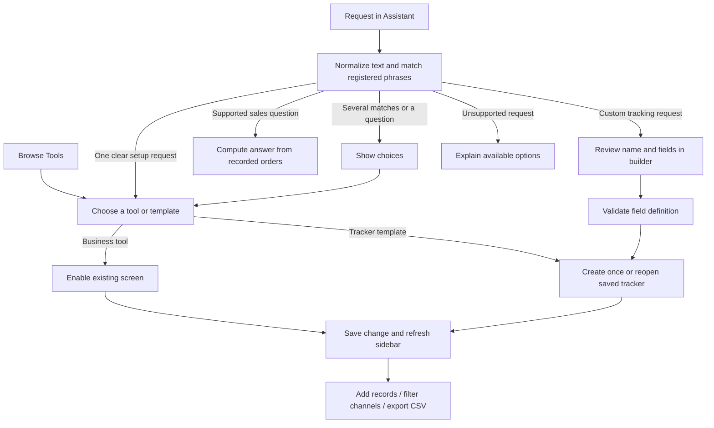

# Shuug: a workspace that grows when you ask

The default Assistant is deterministic and needs no model, API key, Ollama, or Claude. It selects existing business tools and creates saved trackers from registered definitions. The same library is available through buttons in **Tools**, so every supported setup works without chat.

## The request-to-tool map

The app says **enabled**, **created from a template**, or **configured**. It does not claim to have written or tested new source code at runtime. A new external integration, calculation engine, scheduled job, or workflow outside the registered capabilities still needs development.

## What is implemented

| Request | Result | Persistence / dependency |
| --- | --- | --- |
| “I need to track sample requests” | Samples tracker: business, buyer, product, quantity, sent date, follow-up, status, owner, notes | Local durable tracker |
| “Set up buyer follow-ups” | Buyer, phone, next action, date, status, owner, notes | Local durable tracker |
| “Track returns” | Return reason, order reference, requested credit, status | Local durable tracker; no refund issued |
| “Track deliveries” | Promised date, carrier, tracking number, delivery status | Local durable tracker; manual updates |
| “Track promotions” | Offer, start/end dates, entered budget and status | Local durable tracker; no campaign launched |
| “Track purchase orders” | Supplier, PO reference, expected date, cost and status | Local durable tracker; no supplier order sent |
| “Track batches” | Product, lot, best-before date and quality status | Local durable tracker |
| “Track tasks” | Task, owner, due date and progress | Local durable tracker |
| “Track commissions” | Rep, customer, order, entered amount, due date and payment status | Local durable tracker; no payroll calculation |
| “Enable inventory” | Existing Inventory & shipping screen added to sidebar | Existing in-memory demo, clearly labeled |
| “Add invoice checker” | Existing supplier invoice analysis screen | Existing in-memory demo, clearly labeled |
| “Open Amazon” | Shipping pipeline with products, partial quantities, packages and observed history | Connect Amazon through Settings; snapshots persist |
| “Plan store visits” | Store finder | Google Places / Maps / Routes for live services |
| “Research competitors” | Marketing screen | Sourced starter research; optional Brave Search and Ads data |
| “Show sales by channel” | Deterministic amounts from recorded orders | All recorded dates, product sales excluding freight |
| “Show top products/customers” | Top five by recorded product sales | Source and demo status shown |
| “Create a tracker for equipment with fields…” | Opens the field builder | User reviews the schema before creation |

The workspace includes customers, orders, products, store finder, marketing, money and reports. Optional tools and trackers appear under **Your tools** only when enabled. Hidden trackers remain accessible in Tools and keep every record.

## Tracker capabilities

- Each template has a **Preview** button showing a records table and editable entry form with fictional examples. Previewing never creates a tracker or saves entered values. The preview can open the field builder or activate the template explicitly.
- Up to 16 fields: text, long notes, number, USD amount, date, choices, checkbox.
- Every record has a **Bulk**, **Stores**, or **Online** channel, plus creation/update timestamps.
- Add and edit records, search all entered values, filter a template's status, archive and restore.
- CSV exports respect the active filters, quote commas/newlines, and escape spreadsheet formulas.
- A visible sum of an entered money field is available; it is labeled as entered amounts, not accounting truth.
- Template definitions are copied at creation. Existing trackers retain their original fields when the catalog changes.
- Customization is available before creation. Post-creation schema migrations, relationships, formulas, file attachments, scheduled reminders and external automation from tracker records are not implemented.

## FortuneWheel design reviewed

The local FortuneWheel implementation was inspected in `README.md`, `DirectorActionProposal.swift`, and `DirectorActionBroker.swift`. It uses a host-controlled action vocabulary, validates structured proposals, and records outcomes around its Ollama/Claude worker stages.

Shuug borrows the explicit action vocabulary and durable outcome records. Its runtime has no model director, subprocess builder, source-file writer, package installer, arbitrary SQL, or runtime evaluation. The only feature operations are enabling an allowlisted tool, creating a validated tracker, and editing its records. The web chat cannot grant itself new capabilities.

## Implementation map

| Layer | Files | Responsibility |
| --- | --- | --- |
| Tool inventory | `src/lib/features/catalog.ts` | Fixed routes, aliases, requirements, nine tracker templates |
| Request matching | `src/lib/features/resolve.ts` | Token-bounded phrases; longest overlapping alias wins; multiple matches show choices; questions/negatives do not activate |
| Execution | `src/lib/features/assistant.ts` | Calls registered operations and constructs replies from observed results |
| Typed definitions | `src/lib/features/model.ts` | Schema, value and size validation; no executable fields |
| Durable records | `src/lib/features/store.ts` | Atomic file replacement, exclusive writer lock, record revisions, retry deduplication, last 200 changes |
| Server access | `src/lib/connections/access.ts` | Local development owner checks and production gateway token |
| Assistant UI | `src/components/BusinessAssistant.tsx` | Requests, examples, clear replies and links |
| Library / builder | `src/components/FeatureLibrary.tsx` | Enable/hide, templates, custom fields, recent changes |
| Record workspace | `src/components/TrackerWorkspace.tsx` | Forms, search, channel/status filters, archive/restore, CSV |
| Sidebar | `src/components/WorkspaceShell.tsx` | Shared channel selection and enabled tools |
| Optional HTTP interface | `POST /api/workspace/assistant` | Same owner access and router; body `{ "question": "What can you do?" }`, max 8 KB |

## Storage and boundaries

`DEALDESK_DATA_DIR` defaults to `.data` in the project directory. Trackers, enabled tools and recent changes are stored in `features.json`; prospect lists in `visits.json`; encrypted connections in `connections.enc` with `vault.key`; Ads and invoice submissions have their own receipts. These files require a persistent, owner-private volume and backups. Tracker/visit records are private files, not encrypted database columns.

The tracker store uses a write lock and atomic replacement. Each record edit carries its revision so a stale tab cannot overwrite a newer edit. Template activation reuses the existing template instance, and a custom-create UUID makes network retries idempotent. Corrupt state is never silently replaced. A live writer lock returns a retry message. This storage is for one merchant on one host, not a multi-tenant or multi-host service.

Core customer/order persistence remains Postgres when `DATABASE_URL` is set, otherwise an explicitly labeled in-memory demo. Imported profiles and their pricing changes additionally persist in `imported-customers.json`; Amazon order snapshots and observed transitions persist in account-scoped files. See [imports and shipping](CUSTOMER-IMPORTS-AND-SHIPPING.md). Existing operations and invoice-audit data are also in-memory. Enabling those screens does not turn them into durable production systems.

Model-assisted ad copy remains an optional, separate marketing capability. Feature setup and default assistant answers never call it. Live connections require the owner's credentials and service permissions. Campaign and invoice writes retain their own review steps; a request to enable a tool does not authorize remote writes.

## Extending the catalog

1. Implement the actual tool or a reusable tracker template.
2. Register its stable ID, route, aliases, requirements and description in the catalog.
3. Test the real mutation and failure behavior. Include ambiguity and negative requests for new aliases.
4. Add any connection wizard fields if a service is required.
5. Deploy the reviewed source change. The feature then becomes available for deterministic activation.

The next extensions should follow proven business demand: durable stock movements, customer-linked tracker fields, approved formula types, scheduled follow-up reminders, then approved automation recipes. Each needs its own implemented execution path and verification before being offered as available.
